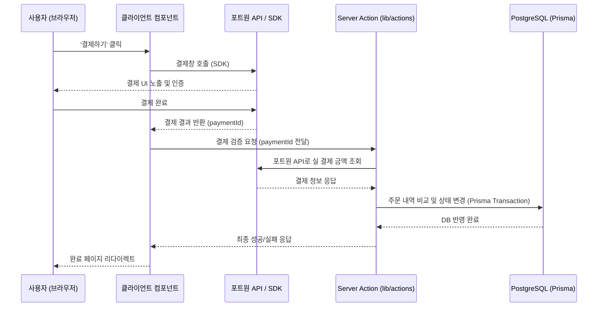

# 포트원(Portone) 결제 연동 프로토콜

이 프로토콜은 KREDU LMS 리뉴얼 프로젝트에서 수강 신청 시 결제 기능을 안전하게 연동하기 위한 에이전트 전용 작업 지침서입니다. 결제 트랜잭션의 정합성 보장과 오류 예방을 위해 다음 절차를 따릅니다.

---

## 1. 결제 아키텍처 흐름

결제 처리는 클라이언트(Portone SDK)와 백엔드(Server Action & Prisma DB) 간의 2단계 검증(Two-step verification)으로 이루어집니다.

---

## 2. 구현 단계 및 가이드라인

### 1단계: 프론트엔드 포트원 SDK 로드 및 결제창 호출
- **SDK 로드**: `next/script`를 사용하여 포트원 SDK v2를 로드합니다.
- **결제창 연동**: 결제 버튼 클릭 시 포트원 결제 함수(`window.PortOne.requestPayment`)를 호출합니다.
- **요구 파라미터**: 
  - `storeId`, `channelKey`, `paymentId` (주문 ID 고유값), `orderName`, `totalAmount`, `customer` 정보 등

### 2단계: 백엔드 결제 검증 (Server Action)
- **위치**: `src/lib/actions/payment.ts`
- **로직**:
  1. 포트원 인증 토큰 발급 API 호출.
  2. `paymentId`로 포트원에 결제 단건 조회 API 요청하여 실 결제 금액(`amount`)과 상태(`status: "PAID"`) 확인.
  3. 데이터베이스(Prisma)에 기록된 주문 정보의 예상 금액과 실 결제 금액 비교.

### 3단계: Prisma DB 트랜잭션 및 정합성 보장
- 두 금액이 일치하면 `prisma.$transaction`을 사용하여 원자적(Atomic)으로 작업을 처리합니다:
  - `Payment` 테이블에 결제 완료 로그 추가.
  - `Order` 테이블의 주문 상태를 `COMPLETED`로 업데이트.
  - `Enrollment` 테이블에 학생 수강 신청 정보 추가 및 활성화.
- 금액 불일치 혹은 검증 실패 시, 결제 취소 API를 트리거하고 트랜잭션을 롤백합니다.

---

## 3. 에외 및 에러 처리 기준
1. **결제 중도 이탈**: 사용자가 결제창을 닫거나 취소한 경우, 적절한 피드백 메시지를 노출하고 결제 시도 상태를 `CANCELLED`로 변경합니다.
2. **금액 불일치 (위변조)**: 예상 금액과 실 결제 금액이 다르면 즉시 에러 로그를 남기고, 포트원 **결제 취소 API**를 호출한 후 트랜잭션을 반려(Reject)합니다.
3. **네트워크 오류**: 외부 API 요청 실패 시 재시도 메커니즘을 적용하되, 수강 권한이 이중으로 할당되지 않도록 `paymentId`에 고유 인덱스(`unique`) 제약 조건을 반드시 부여합니다.
